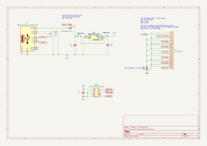
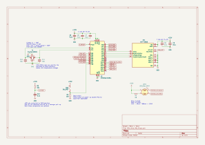
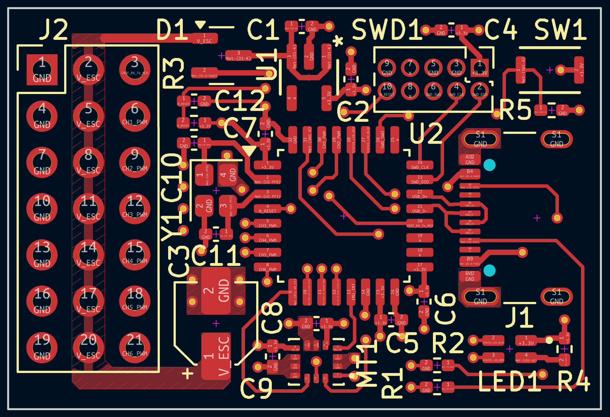
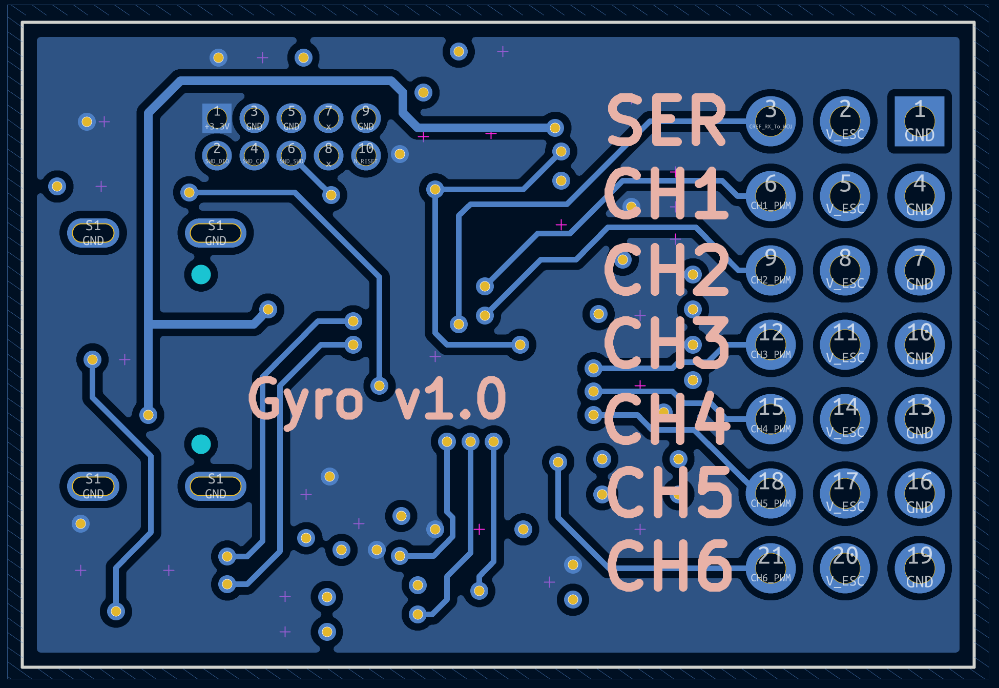
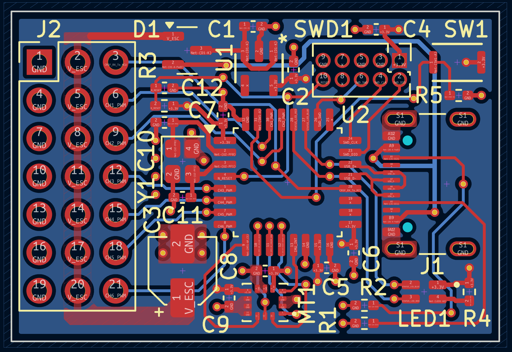
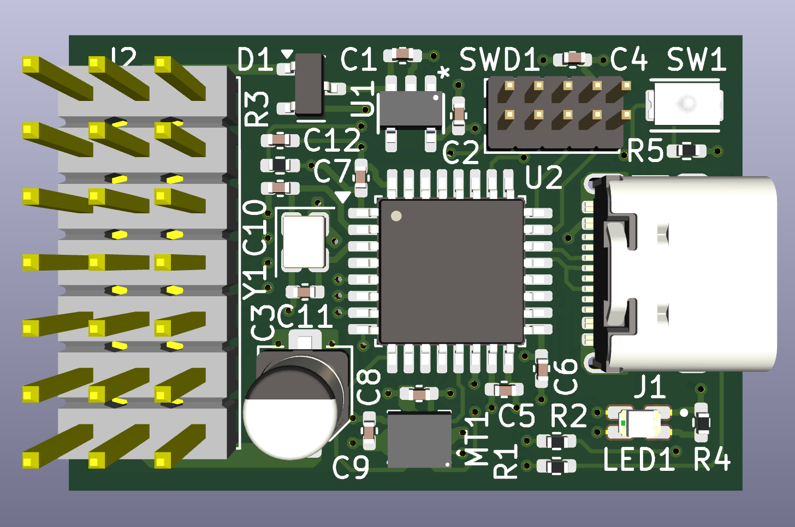
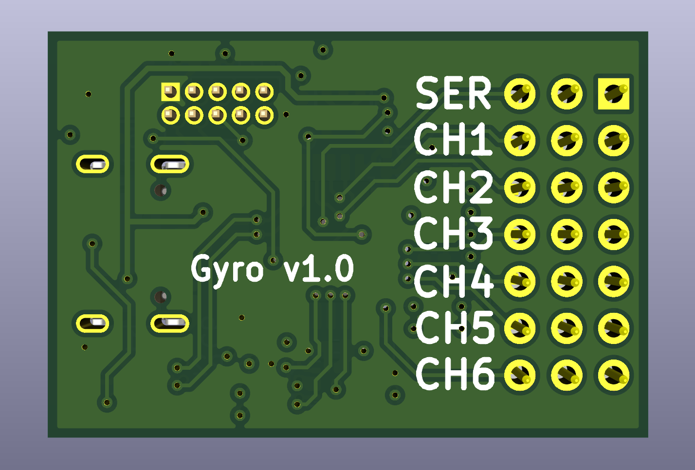

# Open_PWM_Gyro
## Description
6-channel PWM gyro for fixed wing RC planes. Meant to be connected to an ELRS RX or other RX that outputs CRSF serial data.

### Layer Stackup
This is a 4-layer board with the following stackup:
1. Signal + Power
2. Ground
3. Ground
4. Signal + Power

Both ground layers are solid ground pours and aren't shown in the images section below

### Features
- USB-C for device firmware upgrade and configuration
- SWD header for device programming and debugging
- 2-color status LED (red, blue) controlled by the MCU
- Boot switch to allow the device to enter the bootloader on power-up
- 6-axis IMU (3-axis accelerometer, 3-axis gyroscope)
- Pin header for servo/ESC connections with one 3-pin group for serial data input from the RX

### Firmware
Firmware for this gyro can be found [in this repo](https://github.com/jerinabr/Open_PWM_Gyro_Firmware)

## BOM
| Reference             | Qty | Value                       | Footprint                                                             | DigiKey Part #                |
| --------------------- | --- | --------------------------- | --------------------------------------------------------------------- | ----------------------------- |
| C1,C5,C6,C7,C8,C9,C12 | 7   | 0.1u                        | Capacitor_SMD:C_0402_1005Metric_Pad0.74x0.62mm_HandSolder             | 1276-6720-1-ND                |
| C2,C4                 | 2   | 1u                          | Capacitor_SMD:C_0402_1005Metric_Pad0.74x0.62mm_HandSolder             | 1276-1445-1-ND                |
| C3                    | 1   | 22u                         | Capacitor_SMD:CP_Elec_4x5.4                                           | 732-8413-1-ND                 |
| C10,C11               | 2   | 10p                         | Capacitor_SMD:C_0402_1005Metric_Pad0.74x0.62mm_HandSolder             | 311-1014-1-ND                 |
| D1                    | 1   | PMEG2005CT,215              | Package_TO_SOT_SMD:SOT-23                                             | 1727-5188-2-ND                |
| J1                    | 1   | USB_C_Receptacle_USB2.0_16P | Connector_USB:USB_C_Receptacle_GCT_USB4105-xx-A_16P_TopMnt_Horizontal | 2073-USB4105-GF-ATR-ND        |
| J2                    | 1   | Conn_01x21                  | Connector_PinHeader_2.54mm_Custom:PinHeader_3x07_P2.54mm_Vertical     | TSW-107-26-F-T-ND             |
| LED1                  | 1   | LED_Dual_AKKA               | LED_SMD_Custom:LED_APHBM2012QBDSURKC                                  | 754-1506-1-ND                 |
| MT1                   | 1   | ICM-42605                   | Package_LGA_Custom:XDCR_ICM-42605                                     | 1428-1152-1-ND                |
| R1,R2                 | 2   | 5k1                         | Resistor_SMD:R_0402_1005Metric_Pad0.72x0.64mm_HandSolder              | 13-RC0402FR-135K1LCT-ND       |
| R3,R5                 | 2   | 10k                         | Resistor_SMD:R_0402_1005Metric_Pad0.72x0.64mm_HandSolder              | 311-10KJRCT-ND                |
| R4                    | 1   | 68                          | Resistor_SMD:R_0402_1005Metric_Pad0.72x0.64mm_HandSolder              | 311-68.0LRCT-ND               |
| SW1                   | 1   | SW_SPST                     | Button_Switch_SMD_Custom:R-667995_MIT                                 | 2508-R-667995TR-ND            |
| SWD1                  | 1   | Conn_02x05_Odd_Even         | Connector_PinHeader_1.27mm:PinHeader_2x05_P1.27mm_Vertical            | S9015E-05-ND                  |
| U1                    | 1   | TCR2EF33_LMCT               | Package_TO_SOT_SMD_Custom:SOT-25 SMV_TOS                              | TCR2EF33LM(CTTR-ND            |
| U2                    | 1   | STM32G431KBTx               | Package_QFP:LQFP-32_7x7mm_P0.8mm                                      | 497-19470-ND                  |
| Y1                    | 1   | Crystal_GND24               | Crystal_Custom:Crystal_SMD_ECS_ECX_2236-4Pin_2.5x2.0mm                | 50-ECS-160-10-36-CKM-TR3TR-ND |

> [!NOTE]
> J2 is a 3x7 2.54mm pitch pin header. This part can be replaced with three 7-pin headers or seven 3-pin headers or some other combination to save cost

## Images
### Schematic
#### Page 1: Power + Connectors

#### Page 2: MCU + IMU

### PCB
#### Top Layer

#### Bottom Layer

#### Top + Bottom Layer

### 3D View
#### Top

#### Bottom

